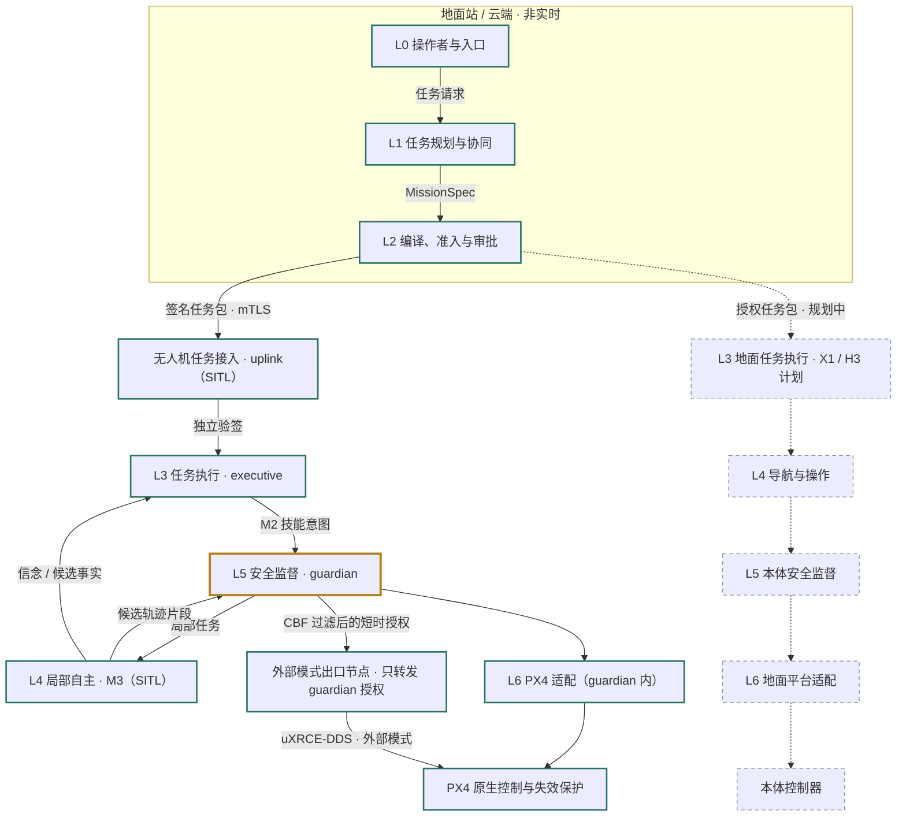

# 架构总览

[项目首页](../../README.zh-CN.md) · [English](../../README.md) · [路线图](../roadmap.md) · [M2 验收](../m2-readiness.md)

## 1. 定位

**drone-agent 建设无人机巡检运营平台，以安全约束任务运行时为执行底座。** 近期在无硬件条件下完成资源准备、业务工作流、任务调度、执行取证、分析复核、工单与复检；真实设备和空地协同按独立门禁扩展（D049）。

首场景是园区三处登记设备的周期巡检与外观异常复检。业务流程可跨天，每次飞行仍是有界 MissionSpec；模型只生成类型化草案和业务判断，控制与恢复由确定性运行时承担。先做多站多无人机任务协同，再复用其目录、所有权与预约扩展空地本体。

### 当前实现与阅读边界（2026-09-25）

原架构审阅基线为 `9223d74`；P0 实现候选为 `271c5ac`，验收见 [P0 记录](../p0-readiness.md)。**M2 已完成单机仿真；M3-SITL 已通过，M3-JIL 待硬件；P0 准出验证中，P1–P5 尚未实现。**

| 链路 | 当前落地 | 进一步阅读 |
|---|---|---|
| 请求与规划 | Web / A2A 入口；MiniMax-M3 草案，确定性构建 MissionSpec | [分层](01-layers.md) |
| 编译与授权 | 能力、空间、时间、能源等准入；审批绑定版本与哈希；Ed25519 签名 | [契约](02-contracts.md) |
| 单机执行 | 独立 uplink；executive 无网络；guardian 唯一决定飞控写入 | [安全](03-safety.md) |
| 局部自主（SITL） | ROS 2 Jazzy、深度局部地图与短时域规划、CBF、外部模式出口、能源可达性 / 恢复 v2、CLIP 候选事件、Zenoh | [M3 记录](../m3-readiness.md) |
| 证据 | 确定性采集复核、可选 VLM 业务判断、三列报告、独立裁判和回放 | [评测](08-evaluation.md) |
| 云端入口与目录 | 统一 M1/M2 飞行台；单机直通 Coordinator、SQLite 任务镜像 | [任务台](../tailnet-desk.md) |

**待实现**：Site/Dock、持久业务工作流、项目角色、多机调度、发现 / 工单 / 复检；完整语义场景图；Jetson / 真机；地面与厂商平台。M3 事件检测是 CLIP 场景分类，不是通用缺陷识别或机载生成式 VLM。空域已有录制 UOM 后端，没有 live 报备能力；能耗估计限仿真。

历史验收分别绑定 [M1 `eefe76e`](../m1-readiness.md)、[M2 `f362b9e`](../m2-readiness.md)、[M3-SITL `75382dc`](../m3-readiness.md)。M3 总门禁仍为 `not_passed`，H1 承接 JIL；归档结果不能转借为当前 HEAD 或 P 系列成绩。常驻入口的版本与实调范围见[任务台记录](../tailnet-desk-readiness.md)。

## 2. 五条设计原则

| # | 原则 | 含义 | 违反的典型表现 |
|---|---|---|---|
| 1 | **模型表达目标，运行时执行目标** | 模型提出 MissionSpec / WorkflowSpec 草案与业务判断；确定性代码构建任务规格，运行时负责执行、恢复与安全 | LLM 生成 Python 直接调用飞控；LLM 决定是否悬停 |
| 2 | **单一控制出口** | 自有 PX4 路径所有控制写入经过 guardian 仲裁的唯一出口，携带控制权租约与命令序号 | MAVSDK、ROS 2 节点、技能各自向飞控写设定值 |
| 3 | **证据先于成功** | 执行状态、效果判定、安全判定三元分离；`UNKNOWN` 永远不是成功；依赖步骤只在效果被证实后放行 | 「命令已发送」记为步骤 OK；超时未重发记为 OK |
| 4 | **契约先于模块** | 先定义并测试契约；运营服务对象与冻结机载契约分层；模块随里程碑创建 | 预建几十个空目录；状态塞进 `extras` |
| 5 | **能力协商，不做假统一** | 平台差异通过 `CapabilityDescriptor` 显式暴露，上层据此调整或拒绝 | 给 DJI 适配器伪装一个不存在的 Offboard 接口 |

## 3. 总体分层

**目标架构。** 当前链路在 SITL 中覆盖空中一侧的 L0–L6：M1 / M2 的 PX4/MAVSDK 航线路径，加上 M3 的 L4 局部自主（px4_ros2 外部模式，经 guardian 的 CBF 过滤与短时授权，M3-SITL 已验证，Jetson-in-the-loop 待硬件）；运营层在 P1–P5 引入；地面机器人在 P3 后的 X1 / H3 引入，其他飞控与学习策略按后续里程碑接入。M2 的协调器只为单机分配任务，协同规则只记录不执行。

实线表示当前执行路径（M1 / M2 的航线路径与 M3 的外部模式路径，后者在 SITL 中验证），虚线及标注“计划”的节点表示后续扩展；金色边框的 guardian 是唯一决定写与不写的进程，出口节点只是它在 ROS 2 一侧的延伸（D039）。图中表示任务与控制意图的下行关系，观测、证据和状态按同一边界回传。

- **L0–L2**：Web / A2A / API 入口；Planner、只读工具、Catalog、业务账本与证据复核；确定性编译、准入及审批签名。M2 的 Coordinator 为单机直通，跨机器人协同仍待实施。
- **机载边界**：独立 uplink 拉取任务包；executive 与 guardian 各自验签；飞控连接只在 guardian 内，飞控失效保护与 RC / GCS 接管始终保留。
- **L4（M3，SITL）**：定位健康、深度局部地图与短时域规划、颜色特征感知与事件检测；规划片段只是候选，guardian 过滤后以短时授权经出口节点下发，学习策略只影子运行（D039–D048）。
- **后续扩展**：Jetson-in-the-loop（H1）与受限真机（H2）、其他飞控和地面平台适配按里程碑接入。
- **贯穿链路**：安全监督、观测证据、任务事件、MCAP / ULog 记录、回放与评测。

**关键性质：L1/L2 与 L3–L6 之间传递的是任务及其边界，不是依赖公网连续下发的每帧动作。** 断链时 L3–L5 依据已授权任务包与本地恢复策略自主收尾。

## 4. 运营、执行与验证分别推进

| 路线 | 内容 | 进入条件 |
|---|---|---|
| P0–P5 软件运营 | 资源、机场、持久工作流、调度、多模态业务与运营台 | 复用 M2；具体局部自主场景按需依赖 M3-SITL；完整设计见 [09-operations](09-operations.md) |
| M3-SITL 执行能力 | 维护已验证的局部自主与恢复能力 | 改动按准确候选回归；不借机开放真实设备 |
| H1–H3 硬件验证 | JIL、受限真机、现场持续运营 | 目标设备与实际运行证据；不作为软件工作的采购前置 |
| X1–X3 扩展 / 研究 | 空地协同、厂商平台、VLA / 世界模型、公共内核 | X1 复用 P3；学习策略先影子；内核按 D001 触发 |

白皮书启发、共享评审的采纳与修正见[来源核对](../research/operations-roadmap-review-2026-09-25.md)。运营层不新增飞控路径；厂商托管任务的不同责任边界见[扩展性](06-extensibility.md)。

## 5. 文档地图

| 文档 | 回答的问题 |
|---|---|
| [01-layers.md](01-layers.md) | 每一层具体负责什么、进程与部署拓扑、层间接口 |
| [02-contracts.md](02-contracts.md) | 六类契约、三元状态、幂等键、版本规则 |
| [03-safety.md](03-safety.md) | 四道约束、恢复策略图、停止语义、活性与新鲜度、并发 |
| [04-air-ground.md](04-air-ground.md) | 协同模型、首个端到端场景、四项协同能力、一致性策略 |
| [05-world-model.md](05-world-model.md) | 三种世界、空间契约、BeliefWorld 双层表示 |
| [06-extensibility.md](06-extensibility.md) | 插件点清单、厂商能力协商、模型接入、MCP/A2A 边界 |
| [07-deployment.md](07-deployment.md) | 仿真两条线、容器与镜像、机载硬件、网络与中间件 |
| [08-evaluation.md](08-evaluation.md) | 三分类结果、指标、裁判、故障注入、准出标准 |
| [../decisions.md](../decisions.md) | 技术决策记录（只增不删） |
| [09-operations.md](09-operations.md) | 资源、工作流、调度、发现与工单、运行来源和权限 |
| [../roadmap.md](../roadmap.md) | P/H/X 里程碑、历史映射与退出标准 |
| [../operations-implementation.md](../operations-implementation.md) | P0–P5 / H / X 工作包、责任、依赖与验收 |
| [../p1-implementation.md](../p1-implementation.md) | 下一产品里程碑：12 项工作包、单机场纵向链和故障矩阵 |
| [../reuse-from-embodied-agent.md](../reuse-from-embodied-agent.md) | 从 `embodied-agent` / `car-agent` 复用什么、怎么迁 |
| [../research/](../research/) | 前沿调研与 GPT-6 Pro 评估摘要 |
| [../m0-readiness.md](../m0-readiness.md) | M0 交付核对与实际验证证据 |
| [../m1-skill-catalog.md](../m1-skill-catalog.md) | 五个 M1 技能的参数、资源、取消与完成判据 |
| [../m1-implementation.md](../m1-implementation.md) | M1 实施顺序、运行时边界与证据要求 |
| [../m1-readiness.md](../m1-readiness.md) | M1 验收版本、完整证据与复现边界 |
| [../m2-implementation.md](../m2-implementation.md) | M2 受约束 Agent 的批次、工作包、验收判据与决策待办 |
| [../m2-readiness.md](../m2-readiness.md) | M2 实现范围、候选版本、云端端到端与回归证据、实调准入率基线与发布门禁（已关闭） |
| [../m3-implementation.md](../m3-implementation.md) | M3 局部自主与降级：测量先行、第二控制路径、四类场景 |
| [../m4-implementation.md](../m4-implementation.md) | 原 M4 工作包：H2 真机与 X1 空地联合仿真，含 P1/P3 复用映射 |
| [../cloud-development.md](../cloud-development.md) | 默认云端构建、仿真与验证的操作入口及隔离边界 |
| [../live-simulation.md](../live-simulation.md) | M1 固定任务的实时操作、连接语义与完整证据入口 |
| [../live-console-readiness.md](../live-console-readiness.md) | 实时仿真入口的准确版本、HTTP 操作验证与回归范围 |
| [../tailnet-console.md](../tailnet-console.md) | 云端常驻控制台、Tailscale 私网入口与机内权限边界 |
| [../tailnet-console-readiness.md](../tailnet-console-readiness.md) | 私网入口部署、HTTPS 操作、重启与隔离验证的准确版本 |
| [../tailnet-desk.md](../tailnet-desk.md) | M2 任务台常驻 Tailnet 入口：使用、部署、仿真监管者与进程边界（D035） |
| [../tailnet-desk-readiness.md](../tailnet-desk-readiness.md) | 任务台常驻入口的准确版本、隔离核对、Tailnet HTTPS 任务验收与开发负记录 |
