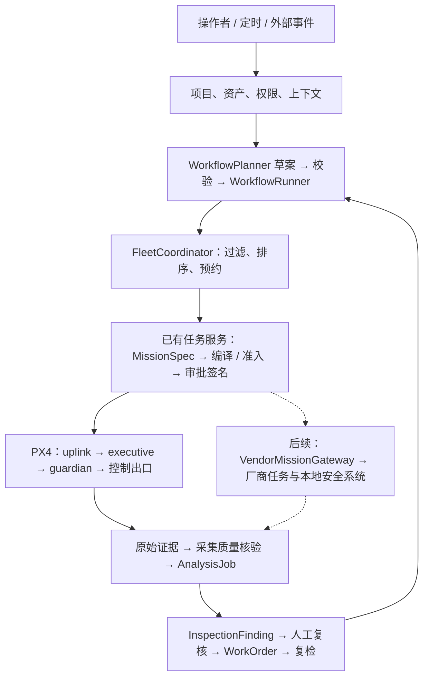

# 运营层：资源、工作流、调度与业务证据

[架构入口](00-overview.md) · [契约](02-contracts.md) · [安全](03-safety.md) · [路线图](../roadmap.md) · [实施任务](../operations-implementation.md)

**状态：2026-09-25 设计基线；P0 来源与门禁已完成（`de597d0`），验收见 [P0 记录](../p0-readiness.md)；P1 已完成（`b49701b`，见 [P1 记录](../p1-readiness.md)）；P2 已完成（`3bdbd50`，见 [P2 记录](../p2-readiness.md)）；P3 实施中（接口见 §13，方案见 [P3 方案](../p3-implementation.md)），P4–P5 仍待实施。** 除明确列出的 P0 来源代码与 P1、P2、P3 已实现部分（§10–§13），本页对象、API 名称和新增文件位置均为设计。已有底座是 M2 任务服务与 M3-SITL；具体差距见[来源核对](../research/operations-roadmap-review-2026-09-25.md)。决策为 D049–D058。

## 1. 产品闭环与执行边界

首场景：每天巡检园区三处登记设备，合格影像进入分析；疑似外观异常由人复核，确认后创建模拟工单；收到维修反馈后发起新的巡检任务，只有新证据符合复检要求才关单。首版每次飞行复用 M2 单资产任务，三处资产通过三个子任务串联，不预设现有单次 MissionSpec 已支持多资产能耗模型。

业务工作流跨越小时或天；飞行任务是一次有界、可取消、能独立收尾的技能 DAG。机载 executive 不等待维修、工单或云端模型。

工作流、目录、调度、分析都位于地面 / 云端 L0–L2。L3–L6 继续只接收已授权任务及其边界。图中的厂商分支是责任边界规划；其任务编译与授权契约必须随适配器单独验证，不能把现有 PX4 `MissionPackage` 原样发送给厂商接口。

## 2. 最小对象与归属

新增对象统一带 `schema_version`；项目内身份采用 `(project_id, object_id)`，消息另带全局 `event_id` / `correlation_id`。动态状态含观测时间、接收时间、有效期与来源。以下为服务侧对象，P0/P1 不把它们塞进已冻结的机载 wire。

| 对象 | 最小语义 | 权威位置 / 首次阶段 |
|---|---|---|
| `Project` / `ProjectMembership` | 可访问资产、体积、资源及角色；身份来自受信入口 | 服务端权限 / P1 |
| `Site` | 站点、坐标系 / 地图版本、已批准体积、起降位、环境约束引用 | 版本化目录 / P1 |
| `DockDescriptor` | 厂商 / 模型、可服务设备与载荷、起降 / 充电位、支持动作、安全责任档案 | 版本化目录 / P1 |
| `DockStatus` | 通信、舱盖、占用、补能、环境、维护六个独立维度；各字段来源与新鲜度 | 后端观测，服务只保留投影 / P1 |
| `DispatchEligibility` | 输入快照摘要、资源 / 能力版本、`eligible/blocked/unknown`、原因码、有效期 | 确定性判定 / P1；不替代 Admission |
| `ResourceReservation` | 持有者、资源、窗口、空间界限、状态、证据引用 | 服务事务 / P1 起降位最小子集，P3 完整时空预约 |
| `RunProvenance` | 执行 / 影像 / 规划 / 分析来源、软件与场景哈希、数据和模型版本 | 受信运行入口生成，已通过软件准出 / P0 |
| `WorkflowSpec` | 不可变版本、项目范围、触发器、白名单节点、条件、预算、超时与审批要求 | 业务定义 / P2 |
| `WorkflowRun` / `ActivityAttempt` | 固定定义版本、状态版本、触发身份、节点结果、等待条件、取消代次、子任务绑定 | 持久业务运行账本 / P2 |
| `DispatchDecision` / `TaskAssignment` | 约束输入、候选排除原因、排序、唯一所有者与分配代次 | Coordinator / P3 |
| `AnalysisJob` / `InspectionFinding` | 输入证据清单、分析器 / 模型 / 提示版本、疑似发现、置信度、拒判原因 | 分析结果；不改飞行三元状态 / P4 |
| `ReviewRecord` / `WorkOrder` / `Reinspection` | 审核身份与结论、处置反馈、复检任务及新证据 | 业务账本 / P2 最小模拟，P4 完整 |

`TaskAssignment.assignment_epoch` 是云端分配代次，`TaskLease.lease_epoch` 是机器人持久化控制代次；两者分别校验，不能复制一个数值替代另一个。任务台的“可派遣”只是一个有时效的判断，不是签名授权。

## 3. 机场状态与可派遣性（P1）

### 3.1 状态必须分维度

| 维度 | 状态示例 | 放行要求 |
|---|---|---|
| 通信 | `online/offline/unknown` | 观测新鲜且来源匹配 |
| 舱盖 | `closed/opening/open/closing/jammed/unknown` | 准备起飞时有明确开盖完成回执；不由“在线”推导 |
| 起降 / 充电位 | `free/reserved/occupied/uncertain` | 本任务持预约且无冲突；失联保持占用或不确定 |
| 补能 | `charging/cooling/ready/fault/unknown` | 任务能源上界 + 返回余量满足；冷却 / 补能中不派遣 |
| 环境 | `permitted/deferred/unknown` | 风雨等观测有效且符合站点与平台约束 |
| 运维 | `normal/maintenance/fault` | 无维护锁定；故障不得被迟到的正常状态覆盖 |

S0 模拟器实现同一状态契约、动作请求 / ACK / 物理结果的分离及故障注入；生产服务不读取故障配置或模拟器真值。对 S1，机场为逻辑资源、飞行由真实 PX4 SITL 执行；虚拟开盖不证明真实机械能力。

派遣经过：能力与项目权限过滤 → 状态 / 时间 / 能源检查 → 原子预约 → 编译准入与审批 → **交付前重新检查取消、审批、状态和预约**。机器人实际开始前仍做本地复核。等待审批期间允许软预约到期；过期后重新预约，资源或机器人绑定改变则重编译并重新审批。

P1 调度侧默认 1 Hz 更新、3 s 新鲜度预算、最多 1 s 未来时钟偏差，已按此实现为版本化策略（D055）；`boot_id + seq` 防同会话倒序，重启后须完成新会话对账才替换现有状态。过期、未来时间或缺字段返回 unknown。该预算不修改 guardian 的观测或授权 TTL。

未知执行、ACK 丢失、机场与无人机的在位信息冲突时，预约进入 `uncertain`。只有属于对应任务的终态、新鲜在位 / 落地证据和状态对账满足后才释放；取消、租约过期、心跳断开或重启都不能单独释放。

## 4. 持久业务工作流（P2）

### 4.1 定义与执行

先用 YAML/JSON 定义和时间线，不做拖拽画布。`WorkflowPlanner` 后续可生成类型化草案，确定性校验器限制节点、项目、资产、预算和条件；首版先跑人工选择的固定模板。

活动白名单：`submit_mission`、`await_mission`、`analyze_evidence`、`human_review`、`create_work_order`、`await_repair`、`request_reinspection`、`build_report`。条件使用有类型的谓词，禁止任意 Python / JavaScript、shell、自由 URL 或模型生成代码。外部事件只能触发已批准模板，不能携带审批、飞控命令或新的权限。

流程状态：`pending → running ↔ waiting → completed/failed/outcome_unknown`；取消分为 `cancel_requested → cancelling → cancelled`。等待原因必须区分审批、设备、环境、证据、复核与维修。节点有独立状态与版本，流程 completed 由全部必需业务节点的结果推导，不能由某次飞行 succeeded 推导。

`WorkflowRun` 固定 `WorkflowSpec` 版本；修改模板只影响新实例。变更运行中实例必须产生有审计的新版本和明确的迁移计划，不改历史；涉及已批准飞行时重新准入与审批。

### 4.2 幂等、对账与重启

- 触发去重键：`(project_id, workflow_id, workflow_version, trigger_source, event_id)`；定时触发用计划发生的 UTC 时刻作事件身份，保留 IANA 时区和夏令时策略。错过时刻默认跳过并记录，不在重启后补飞一串旧计划；补跑需显式配置上限与有效窗。
- 逻辑活动键：`(workflow_run_id, node_id, occurrence)`。通信重试不改变该键；`attempt` 仅记录传输 / 计算重试，不能据 attempt 创建新飞行。
- 业务状态变更与 outbox 同事务提交；消费者 inbox 去重后再推进。至少一次传输 + 幂等接收 + 对账实现有效一次业务效果，不宣称网络恰好一次。
- `submit_mission` 固定同一任务请求幂等键；提交超时先查询原 mission，未判明是否已接受前保持等待，不能换新 ID 补发。飞行版本重试仅由既有 MissionService 按 D032 / D037 管理。
- 崩溃点覆盖：持久化前、outbox 提交后、任务服务接受后但响应丢失、节点完成入账前。worker 重启从账本恢复；定时器用持久截止时刻，不能把进程内 sleep 当计时真相。
- P2 一个活动实例只允许一个 worker 持有执行权，CAS 状态版本与 worker fencing 防旧 worker 重复提交。P3 多资源预约沿用同样的持久边界。

### 4.3 取消与授权

取消先持久化 `cancel_requested` 及取消代次，与新的投递领取共用串行化 / 事务边界。取消提交之后不得领取新的飞行 outbox；未投递包失效。取消前已被领取或已到机载的包进入对账，必要操作仍经已有任务服务 → uplink → executive → guardian，不能承诺远端瞬时停飞。

在飞行安全收尾未知时显示 `cancelling/outcome_unknown`，继续接收证据与终态，但不再派遣后继、重试飞行或复检；原报告不改判成功。模板的下一次定时实例与当前实例取消分开：用户可分别取消本次或停用排班。取消排班与实例的权限、作用域及生效时间均入账。

工作流批准只认可定义和业务权限。每次新 MissionPackage 仍需 D032 的审批；定时和告警不能成为自动批准身份。新的自动授权策略不在 P2 范围，须单独 ADR 与对抗评测。

## 5. 多站多机调度（P3）

先检查硬约束，再按确定性规则排序。硬约束：项目权限、平台 / 载荷 / 技能、观测有效性、维护、任务时间窗、能源含返程、起降与通道资源、已授权空间。排序按优先级、预计到场时间、队列等待和使用均衡，固定最终按 robot ID 破同分；规则 / 权重版本化，排除理由可回放。

同一事务承诺 `TaskAssignment` 与预约；数据库唯一约束 / CAS 防两个调度器同时选中同一独占资源。现有单进程 `RLock` 和 `Catalog.capable()` 不能当作这些保证已经实现。延迟 ACK、旧分配代次和重复投递返回原决定或拒绝，不能新建第二所有者。

更换机器人意味着新编译上下文、资源绑定、包哈希、准入和审批。失联设备保留最后状态推导的保守空间包络；软件所有权失效与物理占用解除是两个事件。先对账，再重新分配；在已证明互不冲突的区域可运行其他任务。

第一版用分区、分时、预验证航线，不做近距离编队。任务级接力在已完成子任务或可证明安全的边界交接；不在空中更换现有任务代次。P3 的多无人机调度不需要地面可通行性；X1 再增加 SpatialAlignment 和 rover 自主接受 / 拒绝。

## 6. 业务发现与数据复用（P4）

必须分别表示：飞行执行、采集合格、疑似异常、已确认异常、维修反馈、复检结论。`InspectionFinding` 的模型结论不是 `effect_verdict`，人工确认也不能追认一次失败的飞行。

分析分两层：通用证据完整性 / 时间 / 位姿 / 清晰度核验，及行业分析器。现有色标逻辑保留为版本化基准插件；不把色标比例当通用缺陷检测。VLM 输出只进入候选发现，图片内文字或检索内容都是数据，无权指定工具、审批或模型配置。

`WorkOrder` 由确认的发现生成，重复视频帧按资产、缺陷类型、时空窗口及证据簇聚合；维修反馈只转到 `awaiting_reinspection`。复检必须有维修反馈之后的新采集证据；旧图重复上传、图像哈希相同但采集身份不同、证据缺失和复检失败分别记录，不能自动关单。无法核实采集来源时保持 unknown。

一份影像可支持多个 `AnalysisJob`，每个作业固定输入哈希、权限、模型 / 提示 / 阈值版本。复用须匹配传感器、视角、分辨率、采集时效与授权范围；可见光不能替代热红外，历史录像不能证明本次已飞。原始证据只读保留，分析输出为派生对象。

RAG 查说明书、SOP、规范和历史线索；电量、天气、空域、占用等当次准入事实只取有有效期的结构化查询。旧状态不因向量检索命中而变新鲜。

## 7. 运行来源与分层验证

| 维度 | 设计取值 | 规则 |
|---|---|---|
| 执行后端 | `logical_sim/px4_sitl/vendor_protocol_sim/real_device/none` | 来自受信部署与执行器注册，客户端不能改写 |
| 影像来源 | `sim_render/recorded_real/live_sensor/test_fixture/none` | 按每份证据标注，混合来源不得在聚合时压成一种 |
| 规划 / 分析来源 | 各自为 `live_model/recorded_model/scripted/deterministic/not_run/unknown` | 二者独立，缺 key 写 not_run；回放 / 缓存不能算实调；脚本的缓存仍为 scripted |
| 版本 | 源码 SHA、dirty 摘要、运行 ID、场景 / 平台 / 模型 / 提示 / 数据 / 裁判摘要 | 门禁只接受不可变候选；未知版本明确拒绝计为通过 |

来源绑定到子任务、每份证据和分析作业，流程聚合引用它们的清单。只在云端加显示标签不足以隔离后端：S0/S3 运行环境不挂真实设备、真实证书或生产任务队列；后端选择由服务配置及授权决定。历史回执保留原样，缺项显示 `legacy_unknown`，不回填为 live。

S0 验证逻辑与规模，S1 验证 PX4 软件飞控与执行链，S2 验证授权素材上的模型能力，S3 验证厂商协议处理；四者分别门禁。P3 压测阶梯 10 / 30 / 100 个逻辑节点，物理仿真先 2 台同世界 SITL，3 台是资源测量后的扩展。P5 长稳是 72 小时真实墙钟的系统运营，按排班间歇飞行；加速时间测试另记。

## 8. 入口、权限与厂商责任

运营台扩展现有 console：项目与资产、机队与机场、工作流与任务、证据与业务、运行审计五个工作区。来源、等待原因、不可派遣原因、取消进度和证据缺口是首版信息，拖拽画布后置。

单组织、多项目、少量角色：viewer 只读获授权项目；operator 提交与取消；approver 审批确切任务包；reviewer 确认业务发现；admin 管目录和成员但不天然拥有飞行批准权。角色可组合，所有 API、媒体下载、事件订阅及 worker 活动都在服务端校验项目范围。Tailnet 解决身份来源，不自动授予所有项目；A2A 保留不得审批和控制的限制。

| 执行路径 | 本项目控制边界 | 接入必须声明 |
|---|---|---|
| 自有 PX4 | uplink / executive / guardian，本地单一控制出口 | 技能、模式、取消与恢复、时效、遥测 / 日志可见性 |
| 厂商托管机场（后续） | 任务网关校验和投递高层任务；本地控制与飞控安全由厂商承担 | 固件与协议版本、任务类型、取消 / 返航 ACK 粒度、落地确认、载荷、日志、跨机场能力和不可见项 |

厂商 ACK 只代表请求处理阶段；缺落地或执行结果证据保持 unknown。不能宣称项目 guardian 部署在闭源厂商飞控中。P5 只做 S3 协议模拟，H2/H3 按实际设备另验。

## 9. 模块、存储与实施约束

| 扩展位置（拟新增 / 修改） | 职责 |
|---|---|
| `fleet/catalog.py`、`fleet/resources.py`、`fleet/docks.py` | 资源目录、机场观测与可派遣判定 |
| `fleet/workflow_models.py`、`fleet/workflow.py`、`fleet/workflow_store.py` | 服务侧契约、持久状态机、inbox/outbox 与定时 |
| `fleet/coordinator.py`、`fleet/reservation.py` | 多候选分配、唯一所有权、时空预约与对账 |
| `fleet/analysis.py`、`fleet/findings.py`、`fleet/work_orders.py` | 分析、发现、复核及工单生命周期（P2 的最小工单与复核记录在 `workflow_store.py` / `workflow.py` 中实现，`findings.py` / `work_orders.py` 留给 P4） |
| `fleet/provenance.py`（P0 已实现）、`fleet/vendor_gateway.py`（后续） | 来源记录与后续厂商任务适配 |
| `console/`、`eval/`、`configs/`、`scripts/` | 运营页面、分层模拟与裁判、版本化模板及验证入口 |

继续单仓库、模块化 Python 服务。飞行权威账本留在机载；地面新增运营持久化优先评估 SQLite，媒体保留文件与哈希索引。数据库迁移方案须先列出现有 schema、目标、升级 / 失败恢复和备份验证，再按项目红线获得批准后执行；本次文档设计不执行迁移。新增表也属于 schema 变更，不以“独立运营库”绕过该约束。

轻量服务常驻，SITL 按需，影像分析有队列 / 并发 / 费用上限。P3 先测共享主机两机容量，资源不足记录阻塞并提出具体拓扑，不缩小门禁冒充多机完成，也不自动修改其他项目配额。不预建上述空模块，不引入 Kubernetes / 多数据库；当持久计时、跨天版本迁移和多 worker 故障处理成本超过自建方案时，再评估 Temporal。

## 10. P0 当前来源接口（D054）

`fleet/provenance.py` 的 SourceContext 由进程入口创建；生产 CLI 当前只接受 `--execution-backend none|px4_sitl`，逻辑后端供隔离测试使用，真实设备与厂商后端不在 P0 可选范围。每个任务版本创建时在同一写入中保存 RunHeader 与规划记录，后续采集 / 分析只追加密封记录。RunProvenance 是这些记录的冻结投影，具有可复算 SHA-256；随迟到证据产生新投影不等于修改原记录。

服务 `view` 的每个版本有 `provenance`，每份 evidence 有独立来源；report.provenance 与 A2A summary.provenance 保留逐版本清单。现有 API 不接受来源或后端参数。任务台增加只读来源展示，证据浏览器增加 provenance 表。历史行无 RunHeader 时保持 legacy_unknown，不按当前部署补填。

当前贯穿 M2 服务链与本机无设备模式；M1/M3 的历史回执保留原有来源记录，能力清单明确对应旧 SHA。VLM 的可选分析通路有独立来源测试；没有实际分析时为 not_run，不能把规划实调当成 VLM 业务验证。数据库 schema v1、控制授权与机载 wire 不变。

## 11. P1 当前接口（D055 / D056）

| 位置 | 已实现内容 |
|---|---|
| 目录 | `configs/sites/p1_campus_v1.yaml`（S0：`campus_ops` 三站三机场三台逻辑 UAV，`harbor_ops` 为隔离夹具）；`p1_s1_v1.yaml`（S1 与常驻任务台：`campus_s1`，`dock_s1` 服务 PX4 SITL 上的 `uav_01`）。成员列表是受信部署输入。不带 `--catalog` 的服务保持 M2 行为 |
| 服务模块 | `fleet/resources.py`（契约与纯判定）、`fleet/operations_store.py`（schema v2、预约、领取、审计）、`fleet/docks.py`（报告入账与动作）、`fleet/dispatch.py`（软预约、准备、领取闸门、对账释放、收尾动作） |
| API | `projects`、`missions.submit`、`resources.list/get/eligibility/maintenance` 按项目角色；`docks.report/actions/ack` 只限目录绑定的 `dock:` 身份；旧方法在目录模式下按任务所属项目检查角色，不可读对象一律 `service.not_found` |
| 验证底座 | `eval/dock_simulator.py`、`eval/logical_flight.py`、`eval/logical_uav.py`、`eval/p1_world.py`（S0 世界与 P1-F01–F14）、`eval/judge_p1.py`（S0 / S1 独立裁判）；云端 `scripts/remote_p1.py` 与 `sim/compose.p1.yaml` |
| 策略值 | 3 s 新鲜度、1 s 未来偏差、2 份报告完成新会话对账、软预约 900 s、领取后 30 s 无机器人 ACK 转 uncertain、落地 5 s 后仍无本活动结果转 uncertain |

已知限制：P1 只做固定绑定的单候选检查；S0 的三台逻辑 UAV 不是物理仿真，S1 只有一台 PX4 SITL；逻辑机场不代表机场硬件或厂商协议；各站地图由 M2 园区派生（只改登记表 ID 与降落点归属），规划器仍使用基础场景，编译与准入使用站点地图。多候选排序、时空预约、跨站接力属于 P3。

## 12. P2 当前接口（D057 / D058）

| 位置 | 已实现内容 |
|---|---|
| 模板 | `configs/workflows/p2_campus_v1.yaml`（S0：`campus_round`、`asset_check` + `asset_reinspection`、带间隔排班的 `quick_check`、`harbor_ops` 隔离夹具）；`p2_s1_v1.yaml`（S1 与常驻任务台：`campus_s1` 的 `asset_check`、`campus_round`、`asset_reinspection`，每日排班默认停用）；`analysis_fixture_v1.yaml`（带标注的脚本分析答案）。服务带 `--workflows` 时必须同时带 `--catalog` |
| 服务模块 | `fleet/workflow_models.py`（模板、触发、排班、输出契约与校验）、`fleet/workflow_store.py`（D058 的 9 张 `wf_` 表、迁移 / 演练、租约与 fencing、CAS、outbox、取消代次、业务记录）、`fleet/workflow.py`（引擎：触发、推进、投递、对账、取消、复核、维修反馈、草案、视图）、`fleet/analysis.py`（脚本与确定性颜色特征分析，结果密封进任务版本来源）；`service.submit_workflow` 是唯一的任务提交入口 |
| API | `workflows.list/get`（viewer 起）、`start/cancel/schedule/repair/draft`（operator）、`review`（reviewer）、`event`（只限模板绑定的 `event:` 身份）；不可读对象一律 `service.not_found` |
| 任务台 | hri.v0 增加 `workflows` / `workflow` / `workflow_draft` 下行帧与 `workflows`、`workflow_watch`、`workflow_start`、`workflow_cancel`、`workflow_schedule`、`workflow_review`、`workflow_repair`、`workflow_draft` 上行帧；子任务审批仍在任务视图按任务包哈希逐个进行，没有批量审批或草案激活帧 |
| 验证底座 | `eval/p2_world.py`（S0 世界与 P2-F01–F15）、`eval/judge_p2.py`（S0 / S1 独立裁判）、`eval/p2_prepare.py`、`eval/workflow_adversarial.py`；云端 `scripts/remote_p2.py` 与 `sim/compose.p2.yaml`；门禁 `scripts/verify_p2_release.py` |
| 策略值 | 运行租约 10 s（后半程才续约，接管时代次加一）；每个到期排班只启动启动窗内最近一次，补跑需显式上限；DAG 最多 40 个节点、10 个任务；工单须以 reviewer 确认为条件；复检不链式触发 |

已知限制：分析只有带标注的脚本答案与确定性颜色特征，不代表识别质量；工单只到「待复检」，关单与复检质量属于 P4；一个服务进程一个引擎，多 worker 只在 S0 用例中验证 fencing；草案只返回、不存储、不可激活，生效必须经版本化配置评审。

## 13. P3 当前接口（D059 / D060 / D061）

| 位置 | 已实现内容 |
|---|---|
| 目录 | `configs/scheduling/p3_campus_v1.yaml`（S0：两组相邻站点 a/b、c/d 相距 100 m 与隔离项目 h；共享坐标 `campus`，网格 4 m、缓冲 2 m）；`p3_s1_v1.yaml`（S1：`uav_01` 位于 Gazebo 原点、`uav_02` 位于东 12 m）；`p3_desk_v1.yaml`（常驻任务台：单站点 `site_s1`，改派时限 60 s）。站点地图 `configs/scenarios/p3_*` 由 `eval/p3_layout.py` 生成并由测试钉住；阶梯目录由同一生成器写入 `outputs/`。服务带 `--scheduling` 时必须同时带 `--catalog`，分配模式的工作流模板要求带调度目录 |
| 服务模块 | `fleet/scheduling_models.py`（任务单、分配、目录与状态）、`fleet/coordinator.py`（`decide`：按录制快照的纯判定，硬过滤后按预计到场、近期使用、机器人 ID 排序）、`fleet/reservation.py`（航迹覆盖、网格单元、失联包络）、`fleet/scheduling_store.py`（D060 的 5 张 `sc_` 表、迁移 / 演练、CAS）、`fleet/scheduler.py`（判定、分配事务、撤回、结算与接力、取消级联、视图）；`service.submit_assigned` 为分配生成确定性任务，严格软预约同时持有机器人、机场与航迹单元 |
| API | `tasks.submit`（operator）、`tasks.list/get`（viewer 起）、`tasks.cancel`（operator）；候选必须属于本项目，不可读对象一律 `service.not_found`；`projects` 的每个条目标注该项目是否可调度 |
| 任务台 | hri.v0 增加 `tasks` / `task` 下行帧与 `tasks_watch`、`task_watch`、`task_submit`、`task_cancel` 上行帧；调度面板显示队列、逐候选等待与拒绝原因、各机判定、分配代次与空域持有；被分配的任务仍在任务视图按任务包哈希逐个审批，没有分配或审批帧 |
| 验证底座 | `eval/p3_world.py`（S0 世界、P3-F01–F15 与规模阶梯）、`eval/judge_p3.py`（S0 / S1 独立裁判，S1 按机器人把 Gazebo 真值换回站点坐标后逐任务跑 M2 飞行裁判）、`eval/p3_prepare.py`；云端 `scripts/remote_p3.py`、`sim/compose.p3.yaml` 与两机仿真镜像 `sim/p3.Dockerfile`；门禁 `scripts/verify_p3_release.py` |
| 策略值 | 失联超时 5 s 后包络按平台最大速度随静默时间增长并加 2 m 余量，裁剪到已批准体积；S0 改派时限 5 s、S1 20 s、任务台 60 s；每个任务单至多 4 次分配；判定每轮至多 50 个任务单 |

已知限制：
- S0 的逻辑飞行与阶梯节点不是物理仿真；S1 只证明同一世界的两架 PX4 SITL，机场仍是逻辑的。
- 空域是仿真网格与保守包络，不代表真实空域报备；冲突只靠独占单元与分时化解，不做近距离协同。
- 技能清单（`configs/skills/*.yaml`）把资源名写成 `uav_01.motion` / `uav_01.camera`，编译、准入与机载校验逐字比对清单，因此 `uav_02` 的任务包与机载租约沿用这些名字；地面预约按机器人正确命名（`uav_02.motion`），每架飞行器的租约只在自己的 guardian 内生效，不影响互斥。资源名模板化属于技能契约与机载校验变更，留待真机多机（H 系列）之前处理。
- 每个用例每架飞行器至多飞一次；单实例换电不在两机世界中实现。
