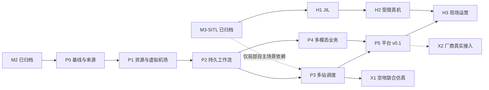

# drone-agent 路线图

[架构](architecture/00-overview.md) · [运营层设计](architecture/09-operations.md) · [全部实施任务](operations-implementation.md) · [P1 详细方案](p1-implementation.md) · [修订依据](research/operations-roadmap-review-2026-09-25.md)

**2026-09-25 修订（D049–D053）：软件运营主线 P0–P5、硬件验证线 H1–H3、扩展线 X1–X3 分开推进。** 近期交付无硬件也可验证的园区巡检运营平台：授权目标 → 资源准备 → 工作流 → 飞行取证 → 分析复核 → 工单 → 复检。既有安全运行时继续作为执行底座。

按退出证据推进，估算不作为准出依据。P1、P2 和预置航线的 P3 可复用 M2 `mission_upload`，不等待 Jetson；用到局部自主的场景才依赖相应候选的 M3-SITL。所有表中“目标”均为待实现验收条件。

## 1. 当前事实与历史里程碑

| 阶段 / 能力 | 准确状态 | 证据边界 |
|---|---|---|
| M0 | 2026-09-19 完成 | 契约、proto、环境冒烟；258 项测试，[记录](m0-readiness.md) |
| M1 | 2026-09-20 完成，单机仿真 | `eefe76e`，400 项测试、66/66 场景、14 恢复边，[记录](m1-readiness.md) |
| M2 | 2026-09-23 完成，受约束 Agent 仿真闭环 | `f362b9e`，775 项测试、E2E 18/18、M1 66/66；MiniMax-M3 实调基线独立记录，[记录](m2-readiness.md) |
| M3-SITL | 2026-09-25 已通过 | `75382dc`，983 项测试、M3 48/48、M1 66/66、M2 18/18、Zenoh 6/6；周期 p99 ≤106.6 ms，[记录](m3-readiness.md) |
| 原 M3 组合门禁 | **未关闭** | `m3_sitl=passed`，`jil=missing`，总状态 `not_passed`；H1 承接未完成 JIL，未降低门槛 |
| P0 | 文档部分完成，来源与门禁代码待实施 | 本次不新增运行验收，不能写 P0 已关闭 |
| P1–P5、H1–H3、X1–X3 | 待实施 / 待对应条件 | 下表和任务计划定义未来交付，不代表已运行 |

M1/M2 的历史实施清单分别保留在 [M1](m1-implementation.md)、[M2](m2-implementation.md)；M3 的原工作包和 SITL/JIL 分项保留在 [M3](m3-implementation.md)。[M2 评审](m2-review-2026-09-24.md)、[固定入口](tailnet-console-readiness.md)、[任务台](tailnet-desk-readiness.md)均为各自版本的验收，不转借为 P 系列结果。原 M4–M6 的 2027 日历窗口退出活动排期，以本次依赖图与硬件条件为准。

## 2. 产品主线 P0–P5

| 阶段 | 目标与交付 | 硬退出标准 | 依赖 / 任务入口 |
|---|---|---|---|
| **P0 范围与证据基线** | 当前能力盘点、来源契约、旧任务映射、产品门禁 | 设计 / 实现 / 仿真 / 硬件状态明确；运行来源贯穿服务与证据；历史结果不回填；所需门禁按准确候选检查 | 文档已完成；WP-P0-03/04 待实施，[任务](operations-implementation.md) |
| **P1 云端资源与虚拟机场** | Project / Site / Dock、设备能力与状态、可派遣判断、最小预约、资源入口 | 3 站 / 3 Dock / 3 逻辑 UAV；充电、维护、离线、过期、卡盖不错误派遣；失联占用不错误释放；单机 S1 正式链路通过 | P0；[P1 详细方案](p1-implementation.md) |
| **P2 持久工作流 v1** | 人工 / 定时 / 事件触发；版本化流程、持久状态、审批、取消、重启对账；分析 / 复核 / 模拟工单 | 巡检—分析—人工复核—模拟工单闭环；重启不丢任务；重复事件不重复派飞；取消后不派后继；未知收尾不算成功 | P1；WP-P2-01–08 |
| **P3 多站多机任务调度** | 硬约束过滤、确定性排序、任务所有权、时空预约、故障对账、任务级接力 | S0 10/30/100 逻辑节点阶梯；至少 2 台同世界 S1 ×3 种子；双重所有权、重复执行、丢任务、冲突预约、假成功均 0 | P2；WP-P3-01–06；3 台 S1 为容量评估后扩展 |
| **P4 多模态业务闭环** | 授权素材、通用质量核验、行业分析插件、发现 / 复核 / 工单 / 复检；证据报告 | 冻结测试集与指标；live / recorded / scripted 分开；模型不改变安全 / 效果判定；图像指令无执行权；缺新证据不关单 | P2；WP-P4-01–06；可与 P3 并行 |
| **P5 无硬件平台 v0.1** | 五工作区集成；一条完整主场景 + 第二业务模板；厂商协议模拟与运维交付 | 72 h 真实墙钟长稳；排班、重启、断网、取消、权限与模型故障可对账；全链路版本 / 来源 / 证据可复算；S3 合同测试通过 | P3 + P4；WP-P5-01–05 |

P1/P2 可先做单机场纵向子集；P1 正式关闭仍需三站逻辑验证，P2 正式关闭仍需 P1 和单机 SITL 业务闭环。P3/P4 的准备性研究可提前，完成声明按各自门禁。

图中历史门禁是能力起点；对后续改动的验收仍在新的同一候选上取得，不能借箭头继承旧 SHA 的测试成绩。周期和责任分工见[实施计划](operations-implementation.md)。

## 3. 硬件线 H1–H3

| 阶段 | 原工作承接 | 退出标准与依赖 |
|---|---|---|
| **H1 目标算力 / JIL** | M3-JIL、arm64 镜像、Jetson 拓扑、D040 重测、机载生成式 VLM 评估 | Jetson 上四类故障 ×3 种子、完整 M1 回归、真实延迟 / 热 / 资源竞争；独立配额满足预算；具体 JIL 门禁实现后才关闭。待硬件 |
| **H2 台架与受限真机** | M4-A 的 11 个工作包 | H1 与目标控制路径的同候选 SITL 准入；接管 / 飞控失效保护 / 伴飞计算机断电 / 串口断开按台架、系留、受限任务递进；首版仅 mission_upload |
| **H3 现场持续运营** | M5 的真实运行与业务交付 | P5 + H2；实际网络、能源、传感器、维护、机械动作、业务结果可验证；真实空地部分还要求 X1 与对应设备 |

H1/H2 的采购、系统变更和现场执行条件不因本次文档修订获得批准。无硬件不阻塞 P 线，P 线通过也不解锁真实设备。

## 4. 扩展线 X1–X3

| 分支 | 范围 | 进入条件 |
|---|---|---|
| **X1 空地协同** | 原 M4-B 联合仿真；之后接 Nav2 与真实地面平台 | P3 后复用目录 / 所有权 / 预约；补地面可通行性、SpatialAlignment、交接与双端证据。不是 P5 前置 |
| **X2 厂商与平台** | P5 的 S3 协议测试之后接真实 DJI 设备；ArduPilot 后续 | 逐设备 / 固件 / 协议能力协商与责任档案；不伪造 guardian 或 Offboard 能力 |
| **X3 研究与内核** | VLA/VLN、WorldPredictor、学习型 LocalPolicy、Pegasus/Isaac、合成数据与训练导出、agent-kernel | 回放 → 仿真 → 影子 → 有限接管；agent-kernel 仍按 D001 双场景契约验证触发；不阻塞 P5 |

## 5. 原里程碑与工作包映射

| 原项 | 新去向 | 保留 / 调整 |
|---|---|---|
| M0–M2 | 历史基线 | 保留验收与编号；作为新产品线底座 |
| M3-SITL：WP-M3-01–20 的仿真部分 | 独立能力门禁 | 已验证范围按 `75382dc`；每项实际落位见 M3 计划 |
| WP-M3-02 arm64、03 JIL、04/15/17/20 的 Jetson 部分 | H1 | 全部保留，具体映射见 [M3 计划](m3-implementation.md) |
| M4-A：WP-M4A-01–11 | H2 | 硬件、接管、空域、现场程序和真机裁判不删减 |
| WP-M4B-03 能力发现 | P1/P3 → X1 复用 | 先 UAV 资源目录，再扩地面本体 |
| WP-M4B-05 所有权 / 交接 | P3 通用所有权 → X1 空地交接 | 接收方可达性与空间对齐留 X1，接受不是转移 |
| WP-M4B-06 预约 | P1 最小独占 → P3 时空预约 → X1 复用 | 失联包络规则贯穿三阶段 |
| WP-M4B-01/02/04/07/08/09/10 | X1 | 同世界 rover、地面运行时、对齐、双端复核、多机裁判、空地基线、Nav2 |
| M5 真实运营 / 地面平台 | H3 + X1 | UAV 运营可独立验证；空地声明需地面链单独通过 |
| M6 多机调度 / 数据飞轮 / 第二厂商 | P3 / P4–P5 / P5(S3)+X2(真实) | 业务数据闭环前移；训练导出和学习策略仍 X3 |
| M6 公共内核 / VLA / 世界模型 | X3 | 原触发条件保留 |

[M4 原工作包](m4-implementation.md)继续承载 21 项详细内容，不再是活动排期中的整体 M4 门禁。`decisions.md` 的旧条目只追加替代关系，不改写当时的决定。

## 6. 验证层级与共同门槛

| 层级 | 证明什么 | 不能证明什么 |
|---|---|---|
| S0 逻辑设备 / 机场 | 状态机、工作流、幂等、预约、故障与规模趋势 | 真实飞行、机械动作、电池性能 |
| S1 PX4 SITL + Gazebo | 飞控软件与正式任务执行、恢复、证据、独立裁判 | 真机气动、无线环境、实际算力和接管 |
| S2 授权真实素材 + 模型 | 分析精度、检索 / 变化识别、拒判、耗时与成本 | 主动采集或实时飞行闭环 |
| S3 厂商协议模拟 | ACK、进度、错误、重连、兼容与任务网关 | 真实设备 / 固件符合协议的程度 |
| H 实物验证 | 对应硬件、场地、配置、版本下的行为 | 其他设备、现场与版本自动通过 |

模拟器进入同一正式服务、审批、事件和证据链，不能另做前端假成功通路。S0/S3 凭据和网络不能触达真实设备；来源标签由受信后端生成。任何 unknown 阻断相应后继，业务关单需要独立的新证据。

每个门禁绑定源码、场景、模型 / 提示、控制面、裁判和原始证据摘要。P5 的 72 h 指系统持续运营与按计划执行，不是连续飞行；加速排班测试单独记录。硬件线缺证据如实 missing，禁止把总门禁失败改名为通过。

## 7. 下一批实施入口

- [ ] WP-P0-03：来源对象与贯穿服务 / 证据的记录。
- [ ] WP-P0-04：新产品门禁与能力清单，保留历史 M3 子结论 / 总结论区分。
- [ ] WP-P1-01 / 02：资源、状态、最小预约与具体持久化设计。
- [ ] WP-P1-03–08：获批后的存储实现、单机场模拟与正式单机 SITL 链。
- [ ] WP-P1-09–12：项目权限、资源入口、三站故障矩阵与准出。

按 [P1](p1-implementation.md) 和[近期批次](operations-implementation.md)领取任务。每阶段更新入口、对应 readiness 和路线状态；只有实际运行才向 `eval/BASELINES.md` 追加结果。季度技术雷达继续保留。
